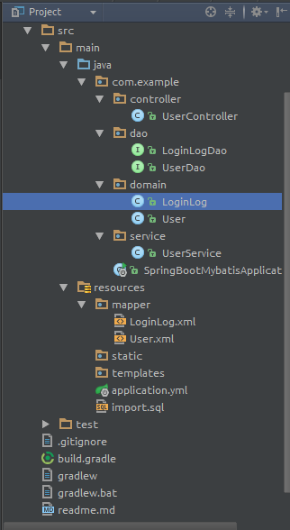
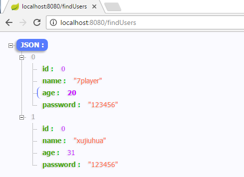

SpringBoot With Mybatis

> 项目搭建参考[IntellijIdea + Gradle + SpringBoot](https://github.com/xujiuhua/SpringBootJsp)
> [官方文档](http://www.mybatis.org/spring-boot-starter/mybatis-spring-boot-autoconfigure/)

本项目主要是介绍`springboot`快速集成`mybatis`，所以采用的自动配置，简化繁琐配置

1. 事务无须配置，只需在Service上添加@Transactional自动生效
2. Json无须配置，只需Cotroller上添加ResponseBody即可

官方介绍为,意思是只要引入`MyBatis-Spring-Boot-Starter`，那么自动做了以下事情：
`MyBatis-Spring-Boot-Starter` will:
- Autodetect an existing DataSource.
- Will create and register an instance of a SqlSessionFactoryBean passing that DataSource as an input.
- Will create and register an instance of a SqlSessionTemplate got out of the SqlSessionFactoryBean.
- Autoscan your mappers, link them to the SqlSessionTemplate and register them to Spring context so they can be injected into your beans.

缺点是不能添加分页等插件，需要分页功能请参考项目[分页](https://github.com/xujiuhua/SpringBootMybatisManual)

# 目录结构

> 其他包需要和SpringBootMybatisApplication放在同一个包下com.example



## 1. build.gradle
添加`mybatis`依赖
```gradle
buildscript {
	ext {
		springBootVersion = '1.4.1.RELEASE'
	}
	repositories {
		mavenCentral()
	}
	dependencies {
		classpath("org.springframework.boot:spring-boot-gradle-plugin:${springBootVersion}")
	}
}

apply plugin: 'java'
apply plugin: 'eclipse'
apply plugin: 'spring-boot'

jar {
	baseName = 'SpringBootMybatis'
	version = '0.0.1-SNAPSHOT'
}
sourceCompatibility = 1.8
targetCompatibility = 1.8

repositories {
	mavenCentral()
}


dependencies {
	compile('org.springframework.boot:spring-boot-starter-web')
	compile("org.mybatis.spring.boot:mybatis-spring-boot-starter:1.1.1")
	runtime('mysql:mysql-connector-java')
	testCompile('org.springframework.boot:spring-boot-starter-test')
}

```

## 2. dao

> 注意是接口，不需要实现。

```java
public interface UserDao {
    List<User> findUsers();

    void updateLoginInfo(User user);
}
```

## 3. mapper

> `namespace`必须是dao的类路径

```xml
<?xml version="1.0" encoding="UTF-8"?>
<!DOCTYPE mapper
        PUBLIC "-//mybatis.org//DTD Mapper 3.0//EN" "http://mybatis.org/dtd/mybatis-3-mapper.dtd">
<mapper namespace="com.example.dao.UserDao">

  <select id="findUsers" resultType="com.example.domain.User">
    select name, age,password from user;
  </select>

  <update id="updateLoginInfo" parameterType="com.example.domain.User">
    UPDATE
       USER
    SET age=#{age}
    WHERE id = #{id}
  </update>

</mapper>
```

## 4. application类

> `@MapperScan("com.example.dao")`表示Mybatis的映射路径

```java
@SpringBootApplication
@MapperScan("com.example.dao")
public class SpringBootMybatisApplication {

    private static Logger logger = Logger.getLogger(SpringBootMybatisApplication.class);

    public static void main(String[] args) {
        SpringApplication.run(SpringBootMybatisApplication.class, args);
        logger.info("===SpringBoot Start Success===");
    }
}

```

## 5. application.yml

```yml
spring:
  datasource:
    url: jdbc:mysql://127.0.0.1:3306/test?useUnicode=true&characterEncoding=utf8&zeroDateTimeBehavior=convertToNull
    username: root
    password: root
    type: org.apache.tomcat.jdbc.pool.DataSource

mybatis:
  mapper-locations: classpath:mapper/*.xml
  type-aliases-package: com.example.domain
```

## 6. 运行




